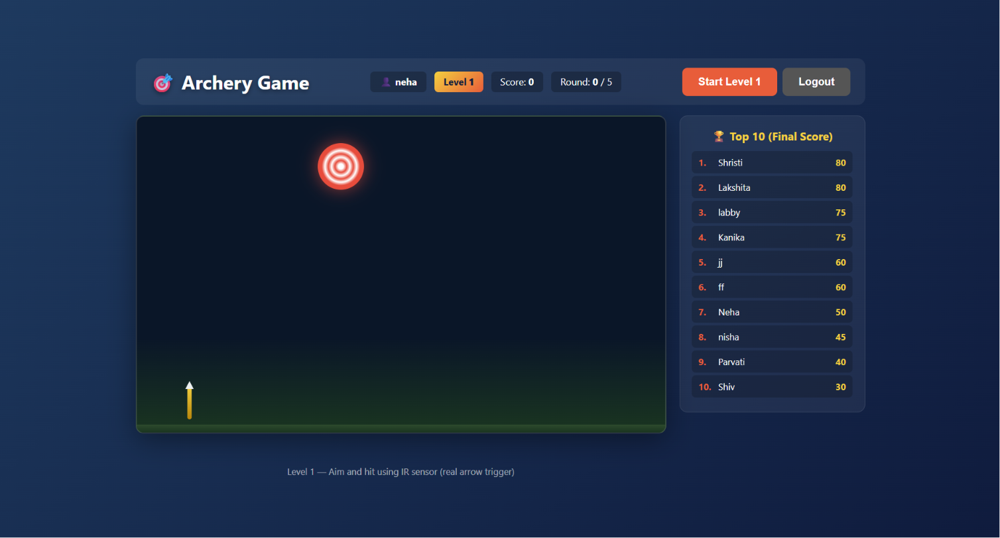

# 🎯 ESP32 Smart Archery Game

### A Real-Time IoT-Based Archery Scoring System using ESP32, IR Sensors, Firebase, and a Responsive Web Dashboard

<!-- 🖼️ Custom banner goes here -->


---
## 📑 Table of Contents


- [Overview](#-overview)
- [Project Highlights](#-project-highlights)
- [Results](#-results)
- [Features](#-features)
- [System Flow](#-system-flow)
- [Hardware Components](#-hardware-components)
- [Software Stack](#-software-stack)
- [Project Structure](#-project-structure)
- [How It Works](#-how-it-works)
- [Screenshots](#-screenshots)
- [Installation](#-installation)
- [Future Improvements](#-future-improvements)
- [Challenges Faced](#-challenges-faced)
- [Lessons Learned](#-lessons-learned)
- [Author](#-author)

## 📖 Overview

The **ESP32 Smart Archery Game** is an IoT-based real-time archery scoring system that combines embedded systems, cloud computing, and modern web technologies to automate the traditional archery scoring process.

The system uses an **ESP32 microcontroller** connected to **IR sensors** to detect arrow hits on the target. Whenever a hit is detected, the ESP32 instantly communicates with the web application, where scores are processed, synchronized with **Firebase Realtime Database**, and displayed on a responsive dashboard in real time.

Unlike conventional manual scoring methods, this project provides **instant score calculation**, **live leaderboard updates**, **multi-level gameplay**, and a seamless user experience by integrating hardware and software into a single connected ecosystem.

This project demonstrates practical knowledge of **IoT systems**, **embedded programming**, **real-time communication**, **cloud integration**, and **responsive web application development**.


---
## 🚀 Project Highlights

* Developed a complete end-to-end IoT application.
* Integrated ESP32 hardware with a responsive web dashboard.
* Connected the system to Firebase Realtime Database for cloud synchronization.
* Implemented real-time score updates and leaderboard synchronization.
* Designed a multi-level gameplay system with automatic score calculation.
* Built a responsive interface for desktop and mobile devices.
* Enabled wireless communication between embedded hardware and the web application.


## 📊 Results

* ✅ Automated real-time archery score calculation.
* ✅ Instant synchronization with Firebase Realtime Database.
* ✅ Live leaderboard updates across connected users.
* ✅ Responsive user interface optimized for multiple screen sizes.
* ✅ Smooth gameplay with automatic level progression.
* ✅ Reliable communication between ESP32 hardware and the web application.
* ✅ Successfully demonstrated an end-to-end IoT-based gaming system.

## ✨ Features

- 🎯 Real-time arrow hit detection
- 📡 ESP32 Wi-Fi communication
- 🔥 Firebase Realtime Database integration
- ⚡ Instant score updates
- 📊 Live web dashboard
- 🏹 Automatic score calculation
- 📱 Responsive user interface
- 🌐 Cloud-connected architecture
- 🏆 Live leaderboard 
- 🔓 Multi-level gameplay with score-based unlocking 

---

## 🏗️ System Flow

```text
             Arrow Hits Target
                     │
                     ▼
              IR Sensor Trigger
                     │
                     ▼
                 ESP32 Board
                     │
                  Wi-Fi
                     │
                     ▼
        Firebase Realtime Database
                     │
                     ▼
        Responsive Web Dashboard
                     │
                     ▼
           Live Score Update
```


---

## 🛠️ Hardware Components

| Component | Purpose |
|---|---|
| ESP32 | Main microcontroller — reads sensors, connects to Wi-Fi, pushes data |
| IR Sensor  | Detects arrow impact location on the target |
| Wi-Fi | Wireless link between ESP32 and Firebase |

---

## 💻 Software Stack

**Frontend**
- HTML5
- CSS3
- JavaScript (ES6)

**Backend & Cloud**
- Firebase Realtime Database

**Embedded**
- ESP32
- Arduino IDE

**Communication**
- Wi-Fi
- WebSockets

---

## 📂 Project Structure


```text

esp32-smart-archery-game/
│
├── firmware/
│   └── archery_game.ino
│
├── web/
│   ├── index.html
│   ├── style.css
│   ├── script.js
│   ├── game.js
│   └── config.js
│
├── docs/
├── images/
├── assets/
│
├── README.md
├── LICENSE
└── .gitignore
```


---


## 🚀 How It Works

1. The player enters their name and starts the game.
2. The ESP32 continuously monitors the IR sensors mounted behind the target.
3. When an arrow interrupts an IR beam, the ESP32 detects the hit.
4. The hit event is transmitted through WebSocket communication.
5. The web application processes the event and updates the player's score.
6. Scores are stored in Firebase Realtime Database.
7. The leaderboard updates instantly for all connected users.
8. Players unlock Level 2 by achieving the required score in Level 1.


---

## 📸 Screenshots

<!-- Add real screenshots once available -->

### Dashboard




---
## ⚙️ Installation

Clone the repository

```bash
git clone https://github.com/mssrishtisharmaa/esp32-smart-archery-game.git
```

Navigate to the project

```bash
cd esp32-smart-archery-game
```


Open the `web/` directory and launch `index.html` in your browser, or serve it using a local development server for the best experience.

Upload the firmware to ESP32 using Arduino IDE.

Configure your Firebase project and Wi-Fi credentials before running.


## 🔮 Future Improvements

- Player login and multi-user support
- Live leaderboard across sessions
-  Multi-level gameplay with score-based unlocking
-  Mobile app companion
- OTA firmware updates
- Performance analytics dashboard

## 🧩 Challenges Faced

Throughout the development of this project, several technical challenges were encountered:

* Establishing reliable communication between the ESP32 and the web application.
* Synchronizing real-time game events without noticeable delays.
* Managing multiple gameplay states across different levels.
* Integrating embedded hardware with Firebase Realtime Database.
* Designing a responsive interface that worked consistently across devices.
* Ensuring smooth score calculation and leaderboard updates during gameplay.

---
## 📚 Lessons Learned

This project provided practical experience in several areas of software and hardware development, including:

* IoT system design using ESP32.
* Embedded programming with Arduino.
* Firebase Realtime Database integration.
* Real-time communication between hardware and web applications.
* JavaScript-based game logic and UI development.
* Responsive web design principles.
* Project organization and documentation using GitHub.

> 🌐 **Live Demo:** https://mssrishtisharmaa.github.io/esp32-smart-archery-game/
## 👩‍💻 Author

**Srishti Sharma**
Computer Science Engineering Student

- GitHub: [@mssrishtisharmaa](https://github.com/mssrishtisharmaa)
- LinkedIn: [srishti sharmaa](https://www.linkedin.com/in/ms-srishti-sharma/)

---
